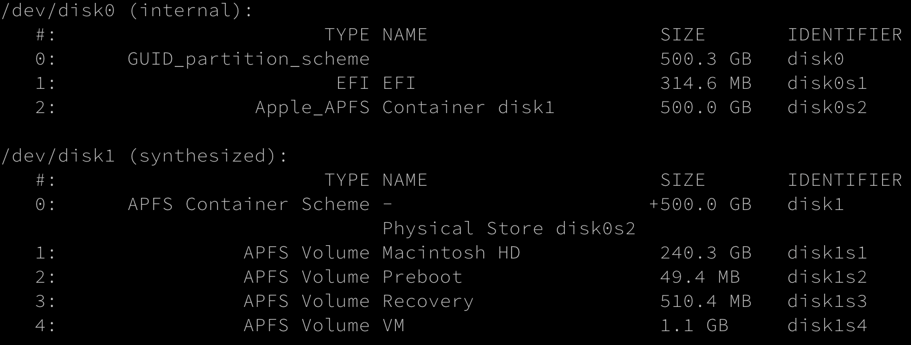
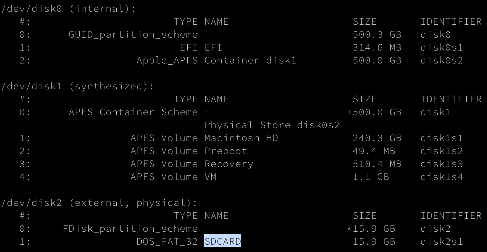
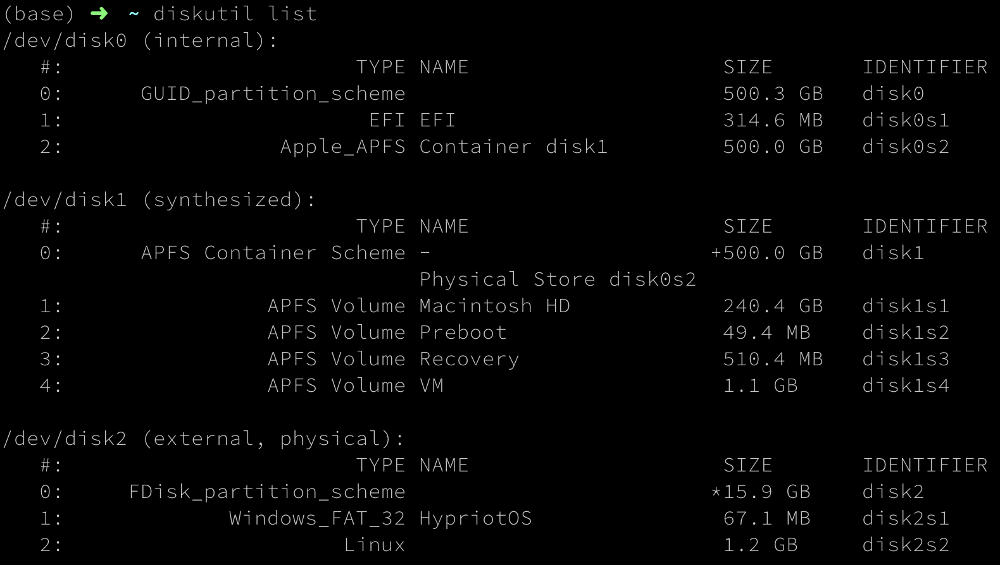

# Skoolcar
Project created for the Skool AI to participe in the IronCar autonomous car competition


## Car Bootstrapping

### Hardware

#### Format SD card to reinstall Rasbian
##### Identify SD card
In Terminal, type the following command:
```shell script
$ diskutil list
```
You should see something like:

In this case /dev/disk2 is my SD card.

##### Format SD card
To reformat the SD card, type:
```shell script
$ diskutil unmount /dev/disk2
$ diskutil unmountDisk /dev/disk2
$ diskutil eraseDisk FAT32 SDCARD MBRFormat /dev/disk2
```
The SD card will be formatted in *FAT32* format under the name *SDCARD* with a Master Boot Record (*MBRFormat*).

##### Verify formatting
To check if the formatting was successful, use above command again:
```shell script
$ diskutil list
```
Look for a disk named `SDCARD` like in the following picture:


##### Flash a Raspbian image
```shell script
$ sudo dd if=/Users/baptiste.ojeanson/Downloads/RPI-IMAGE-TO-FLASH.img of=/dev/disk2 bs=1024
```
`RPI-IMAGE-TO-FLASH.img`:
- `2019-09-26-raspbian-buster-lite.img`
- `hypriotos-rpi-v1.11.1.img`


To check if the flashing was successful, use above command again:
```shell script
$ diskutil list
```
Look for a disk named `HypriotOS` like in the following picture:



##### Enable SSH
Once formatted, to enable *ssh*, create a file named *ssh* in the root dir of the SD card:
```shell script
$ touch /Volumes/boot/ssh
```

To connect to a WIFI network after booting, create a file named *wpa_supplicant.conf* in the root dir of the SD card:
```shell script
$ touch /Volumes/boot/wpa_supplicant.conf
```

And set the network parameters inside:
```shell script
ctrl_interface=DIR=/var/run/wpa_supplicant GROUP=netdev
network={
    ssid="<YOUR-NETWORK-SSID>"
    psk="<YOUR-NETWORK-PASSWORD>"
    key_mgmt=WPA-PSK
}
```

#### Use SSH key to connect to the Raspberry
Once the Raspberry is up, try to connect to it with the following command:
```shell script
$ ssh pirate@black-pearl.local
```
`pirate` is the user on the Raspberry to use and `black-pearl.local` the hostname.

Generate an ssh key pair: a public and a private key.
```shell script
$ ssh-keygen -o -t rsa -b 4096 -C "email@domain.com"
```
Once generated, put the keys in the `$HOME/.ssh/` directory under the names **hypriot_id_rsa** and **hypriot_id_rsa.pub**.

Then, use the following command to put the public key inside the `authorized_keys` file on the Raspberry. This will 
allow to use the private key to log onto the Raspberry without login and password each time.
```shell script
$ ssh-copy-id -i $HOME/.ssh/hypriot_id_rsa USER@HOSTNAME -f
```


Tutorial followed: http://docs.robocarstore.com/ (documentation provided by the store we bought the car from)

### Software

Tutorial followed: https://docs.donkeycar.com/guide/install_software/ (official DonkeyCar documentation)

The car still need a better calibration.
Based on the connection on the servo controller:
- Steering channel: 1
- Throttle channel: 0
(Those can be changed in the config.py file.)

### Adding your wifi

The wifi config file is in: /etc/wpa_supplicant/wpa_supplicant.conf.
If you can't connect to an already configured network to modify this file, you can use an Ethernet cable: https://www.dexterindustries.com/howto/connecting-raspberry-pi-without-monitor-beginners/

### Connecting to the pi

1. Verify that you're sharing the same network: ping donkeypi.local
2. Connect via ssh: ssh pi@donkeypi.local
Password: skoolcar

### Turning off the pi

1. Run the following command: sudo shutdown -h now
2. Wait for the green light to turn off completey before you remove the power. Else you could damage the SSD reader.


## Next steps

- Use the IronCar simulator to run a first supervised approach based on a virtual dataset: https://pypi.org/project/simulateur-ironcar/ 


### Remote control with XBox controler
apt-get install xboxdrv joystick
